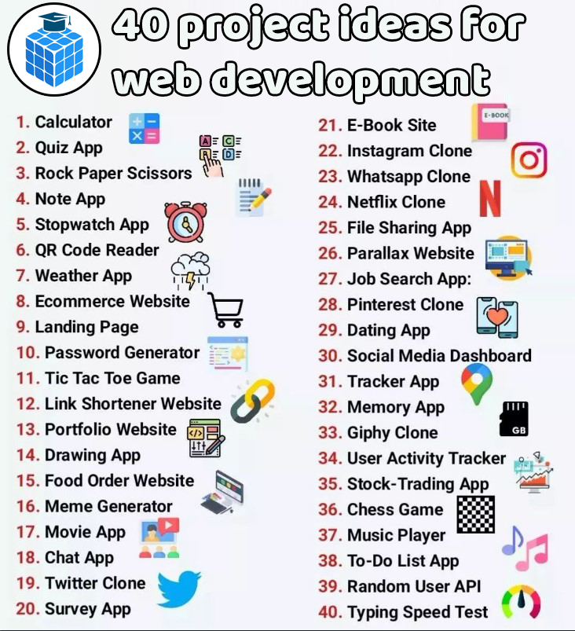

# 40 Projektidéer för webbutvecklare

1. **Kalkylator**  
   _Beskrivning:_ Skapa en enkel online-kalkylator för grundläggande matematiska operationer.  
   _Avancerad:_ Lägg till enhetstestning och möjligheten att spara beräkningar.

2. **Quiz-app**  
   _Beskrivning:_ En frågesport där användare kan svara på frågor och få poäng.  
   _Avancerad:_ Skapa dynamiska quiz där frågor hämtas från ett API.

3. **Sten, sax, påse**  
   _Beskrivning:_ Ett interaktivt spel där användaren spelar mot datorn.  
   _Avancerad:_ Lägg till ett poängsystem och spelstatistik över flera omgångar.

4. **Anteckningsapp**  
   _Beskrivning:_ En applikation där användaren kan skriva, spara och hantera anteckningar.  
   _Avancerad:_ Implementera synkronisering av anteckningar över flera enheter.

5. **Stoppur-app**  
   _Beskrivning:_ En digital stoppur för att mäta tid.  
   _Avancerad:_ Lägg till en timer med flera stoppur och möjlighet att exportera tider.

6. **QR-kodläsare**  
   _Beskrivning:_ En app som kan läsa och avkoda QR-koder med hjälp av kameran.  
   _Avancerad:_ Lägg till möjlighet att skapa och generera egna QR-koder.

7. **Väderapp**  
   _Beskrivning:_ En app som visar väderprognoser och aktuell väderinformation för olika platser.  
   _Avancerad:_ Lägg till platsbaserade notifikationer och veckoprognoser.

8. **E-handelswebbplats**  
   _Beskrivning:_ Bygg en webbplats för att köpa och sälja varor online.  
   _Avancerad:_ Implementera betalningslösningar och hantera flera leverantörer.

9. **Landningssida**  
   _Beskrivning:_ Skapa en enkel och snygg landningssida för att presentera en produkt eller tjänst.  
   _Avancerad:_ Lägg till animationer och responsiv design för alla skärmstorlekar.

10. **Lösenordsgenerator**  
    _Beskrivning:_ En app som genererar säkra lösenord åt användaren.  
    _Avancerad:_ Skapa en lösenordshanterare och kryptera lösenorden.

11. **Tre i rad-spel**  
    _Beskrivning:_ Ett klassiskt spel där två spelare turas om att sätta X eller O i ett rutnät.  
    _Avancerad:_ Lägg till AI som lär sig spela spelet bättre mot användaren.

12. **Länkförkortare**  
    _Beskrivning:_ En webbtjänst som förkortar långa URL-länkar till kortare versioner.  
    _Avancerad:_ Skapa användarprofiler och statistik över förkortade länkar.

13. **Portfolio-webbplats**  
    _Beskrivning:_ Skapa en personlig webbplats för att visa upp dina projekt och färdigheter.  
    _Avancerad:_ Lägg till dynamiska innehållssektioner och en bloggfunktion.

14. **Ritapp**  
    _Beskrivning:_ En enkel app där användare kan rita och skapa bilder digitalt.  
    _Avancerad:_ Lägg till lager av olika penslar, färger och bildfilter.

15. **Matbeställningswebbplats**  
    _Beskrivning:_ En webbplats för att beställa mat från olika restauranger.  
    _Avancerad:_ Lägg till en betalningslösning och live-tracking av leveranser.

16. **Meme-generator**  
    _Beskrivning:_ En app där användare kan skapa och anpassa memes med egna texter.  
    _Avancerad:_ Skapa en meme-databas och lägg till möjligheten att spara memes.

17. **Filmappar**  
    _Beskrivning:_ En app som visar filmer med möjlighet till betygsättning och recensioner.  
    _Avancerad:_ Lägg till trailers och rekommendationer baserade på användarens historik.

18. **Chattapp**  
    _Beskrivning:_ En realtidschatt där användare kan skicka meddelanden till varandra.  
    _Avancerad:_ Implementera användargrupper och privata meddelanden.

19. **Twitter-klon**  
    _Beskrivning:_ En social plattform där användare kan skriva och dela korta meddelanden.  
    _Avancerad:_ Lägg till stöd för mediafiler och möjligheten att följa andra användare.

20. **Enkätapp**  
    _Beskrivning:_ Skapa en app för att skapa och delta i enkäter med olika frågor och svarsalternativ.  
    _Avancerad:_ Lägg till tidsbegränsade enkäter och statistisk analys av svaren.

21. **E-bokssajt**  
    _Beskrivning:_ En webbplats där användare kan läsa och ladda ner e-böcker.  
    _Avancerad:_ Implementera bokmärken och användarbetyg för varje bok.

22. **Instagram-klon**  
    _Beskrivning:_ En plattform där användare kan dela bilder och interagera med andra.  
    _Avancerad:_ Lägg till filter och avancerad bildredigering innan uppladdning.

23. **Whatsapp-klon**  
    _Beskrivning:_ En meddelandeapp för att skicka text, bilder och ljud mellan användare.  
    _Avancerad:_ Lägg till krypterad kommunikation och gruppchattar.

24. **Netflix-klon**  
    _Beskrivning:_ En streamingtjänst för att visa och streama filmer och serier.  
    _Avancerad:_ Lägg till rekommendationssystem baserat på tidigare tittat innehåll.

25. **Fildelningsapp**  
    _Beskrivning:_ En plattform där användare kan ladda upp och dela filer med andra.  
    _Avancerad:_ Skapa versionshantering för filerna och begränsa tillgång via behörigheter.

26. **Parallax-webbplats**  
    _Beskrivning:_ Skapa en webbsida med parallaxeffekter som ger en känsla av djup.  
    _Avancerad:_ Lägg till animerade effekter och responsivitet för olika enheter.

27. **Jobbsökarapp**  
    _Beskrivning:_ En app för att hitta och söka jobb baserat på användarens intressen och kvalifikationer.  
    _Avancerad:_ Lägg till AI-baserade jobbrekommendationer baserat på användarens CV.

28. **Pinterest-klon**  
    _Beskrivning:_ En inspirationsplattform där användare kan spara och dela bilder och idéer.  
    _Avancerad:_ Lägg till möjlighet att skapa samlingar och dela dem med andra användare.

29. **Dejtingapp**  
    _Beskrivning:_ Skapa en plattform för att matcha och interagera med potentiella partners.  
    _Avancerad:_ Implementera matchningsalgoritmer baserat på preferenser.

30. **Social media dashboard**  
    _Beskrivning:_ En översikt som visar statistik och innehåll från flera sociala medier.  
    _Avancerad:_ Lägg till realtidsdata från alla sociala plattformar och exportmöjligheter.

31. **Spårningsapp**  
    _Beskrivning:_ En app för att spåra aktivitet som hälsa, träning eller ekonomi.  
    _Avancerad:_ Lägg till datavisualisering för att analysera mönster och framsteg.

32. **Minnesapp**  
    _Beskrivning:_ En app för att spara och påminna användare om viktiga saker att minnas.  
    _Avancerad:_ Lägg till integration med kalendern för att påminna om viktiga händelser.

33. **Giphy-klon**  
    _Beskrivning:_ En plattform för att söka och dela rörliga GIF-bilder.  
    _Avancerad:_ Implementera ett uppladdningssystem för egna GIF-bilder.

34. **Användaraktivitetsspårare**  
    _Beskrivning:_ En app för att spåra hur mycket tid användare lägger på olika aktiviteter.  
    _Avancerad:_ Lägg till avancerade rapporter om användarnas aktivitetsvanor.

35. **Aktiespårningsapp**  
    _Beskrivning:_ En app för att hålla koll på aktiekurser och skapa en portfölj.  
    _Avancerad:_ Implementera realtidsdata och notifieringar vid stora kursförändringar.

36. **Schackspel**  
    _Beskrivning:_ Bygg ett interaktivt schackspel där användare kan spela mot andra eller datorn.  
    _Avancerad:_ Lägg till multiplayer-stöd och ett rankingsystem.

37. **Musikspelare**  
    _Beskrivning:_ En app för att spela och organisera musikfiler.  
    _Avancerad:_ Implementera streaming och stöd för spellistor och delning.

38. **Att-göra-lista-app**  
    _Beskrivning:_ En enkel app för att skapa och hantera uppgifter och listor.  
    _Avancerad:_ Lägg till möjlighet att samarbeta med andra användare i realtid.

39. **Slumpmässig användar-API**  
    _Beskrivning:_ En app som hämtar och visar slumpmässiga användardata från ett API.  
    _Avancerad:_ Skapa ett API som hämtar data från flera källor för att ge olika användarprofiler.

40. **Skrifthastighetstest**  
    _Beskrivning:_ En app där användare kan testa och förbättra sin skrivhastighet.  
    _Avancerad:_ Lägg till olika testlägen och spara användarens resultat över tid.
