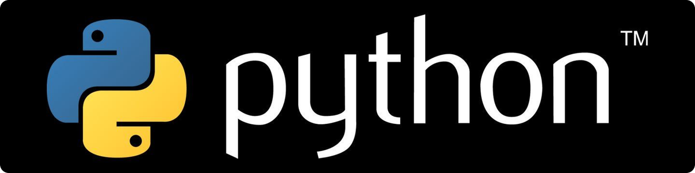

# Kom igång med Python



## Installation och Grundinställningar

Att komma igång med Python-programmering i Visual Studio Code (VS Code) är en spännande resa som kräver några enkla steg för att ställa in din utvecklingsmiljö. Denna guide kommer att visa dig hur du installerar Python, konfigurerar VS Code och skapar ditt första enkla Python-program.

---

### Steg 1: Installera Python

Först behöver du se till att Python är installerat på din dator. Du kan hämta den senaste versionen av Python från den officiella webbplatsen.

1. Gå till [Python.org](https://www.python.org/) och navigera till "Downloads"-sektionen. Webbplatsen ska automatiskt föreslå den bästa versionen för ditt operativsystem.
2. Ladda ner och kör installationsprogrammet. Under installationen, se till att markera kryssrutan "Add Python X.X to PATH" för att lägga till Python i ditt systems sökväg. Detta gör det möjligt att köra Python från kommandotolken eller terminalen.
3. Efter installationen, öppna en kommandotolk eller terminal och skriv `python --version` för att verifiera att installationen lyckades. Du bör se en utskrift som visar den installerade Python-versionen.

---

### Steg 2: Installera och Konfigurera Visual Studio Code

VS Code är en kraftfull och flexibel kodeditor som stöder Python-programmering genom tillägg.

1. Ladda ner VS Code från den officiella [webbplatsen](https://code.visualstudio.com/) och installera den på din dator.
2. Öppna VS Code. För att installera Python-tillägget, gå till Extensions-vyn genom att klicka på Extensions-ikonen i aktivitetsfältet eller genom att trycka på `Ctrl+Shift+X`.
3. Sök efter "Python" i Extensions-marknaden och välj det Python-tillägg som utvecklats av Microsoft. Klicka på "Install".
4. Efter installationen av Python-tillägget, kan VS Code automatiskt upptäcka Python-interpreter som installerades på ditt system. Om det behövs kan du välja en specifik interpreter genom att klicka på statusfältet nere till vänster eller genom att öppna kommandopaletten (`Ctrl+Shift+P`) och skriva "Python: Select Interpreter".

---

### Steg 3: Skapa och Kör Ditt Första Python-Program

Nu när din utvecklingsmiljö är redo, låt oss skapa och köra ett enkelt Python-program.

1. Skapa en ny fil i VS Code genom att välja "File > New File" eller genom att trycka på `Ctrl+N`. Spara filen med `.py`-tillägget, till exempel `hello.py`.
2. Skriv följande kod i filen:

```python
print("Hej, världen!")
```

3. För att köra ditt program, högerklicka i redigeringsfönstret och välj "Run Python File in Terminal", eller tryck på `F5` för att köra programmet i debug-läge.
4. Du bör nu se "Hej, världen!" skrivet i terminalen, vilket betyder att ditt Python-program kördes framgångsrikt.

---

**Grattis!**

Du har nu konfigurerat din dator för Python-programmering med VS Code och skapat samt kört ditt första Python-program!

Lär dig mer Python på någon av länkarna:

- Spellista på YouTube: <https://www.youtube.com/playlist?list=PLI5JF23TK_8BhDh9LzRvDtcR6_aoZH0iP>
- Nybörjarguide online: <https://distansakademin.github.io/python/guide-del-1.html>
- Programmering 1 i Python: <https://www.utbildning.se/kurser/distansakademin-i-sverige/grundlaggande-programmering-python-1-1832613>
