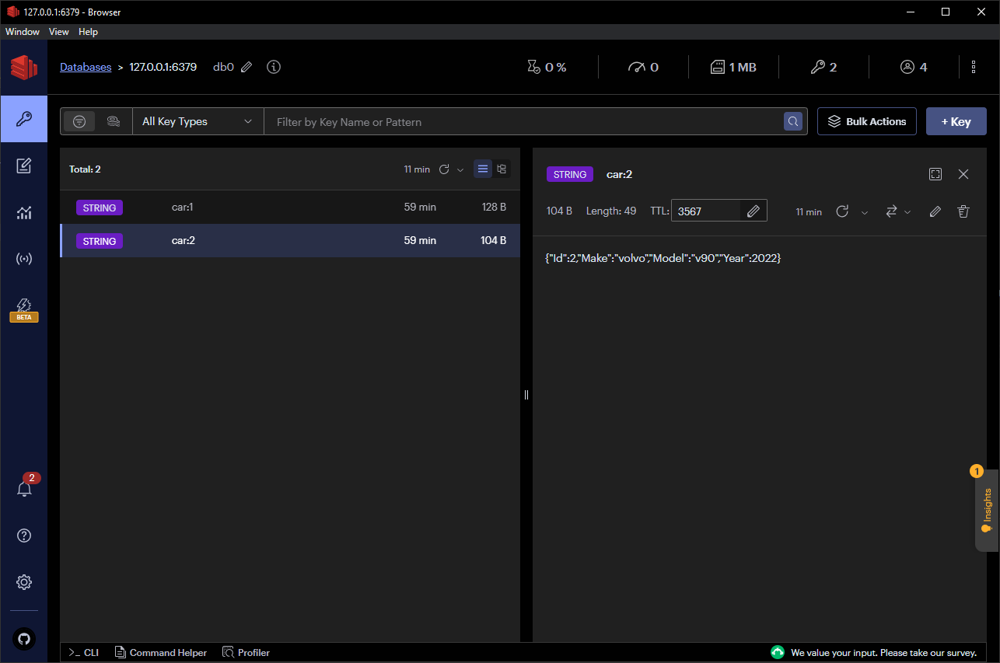

# Guide: Lägg till caching med Redis i ett flerlager Web API byggt med ASP.NET Core

## Inledning

Caching är en teknik som används för att snabba upp åtkomsten till data genom att lagra kopior av ofta begärda data i ett snabbare lagringsmedium, som till exempel RAM. Redis är en populär in-memory databas som ofta används för caching. I den här guiden kommer vi att gå igenom hur du kan integrera Redis i ett flerlager Web API  byggt med ASP.NET för att förbättra prestanda.

## Förutsättningar

- Grundläggande kunskap om ASP.NET Core Web API.
- Förståelse för flerlagerarkitektur med följande lager:
  - `WebAPI`: Detta är API:et som används av klienten (Namnet på projektet kan variera).
  - `Services`: Detta är lagret som innehåller affärslogik och anropar databasen.
  - `Repositories`: Detta är lagret som innehåller anslutningen till databaser och andra externa tjänster (t.ex. Redis)
- En fungerande installation av Redis. Om du inte har Redis installerat kan du följa
  - [Redis officiella installationsguide windows](https://redis.io/docs/install/install-redis/install-redis-on-windows/)
  - [Redis officiella installationsguide mac](https://redis.io/docs/install/install-redis/install-redis-on-mac-os/)
- Redis GUI: <https://redis.com/redis-enterprise/redis-insight/> (valfritt)

### Redis på Windows

Att installera Redis på Windows kan vare lite klurigt. Ni behöver installera WSL (Windows Subsystem for Linux), sedan ett Linux-distro och till siste behöver ni installera Redis i er Linux-miljö. Fölr dessa steg:

1. Installera WSL genom att köra `wsl --install` i PowerShell som administratör.
   - Om ni får ett felmeddelande om att virtualisering inte är aktiverat behöver ni aktivera det i BIOS, detta är olika på olika datorer så sök online efter hur ni aktiverar virtualisering på er datormodell.
2. Starta om datorn.
3. Installera Ubuntu från Microsoft Store: <https://www.microsoft.com/store/productId/9PDXGNCFSCZV>
4. Öppna Ubuntu och följ instruktionerna för att skapa ett användarkonto.
5. Installera Redis genom att följa instruktionerna som finns länkade högre upp.
6. Starta Redis genom att köra `sudo service redis-server start` i Ubuntu.
7. Testa att ansluta till Redis genom att köra `redis-cli` i Ubuntu.
8. Testa att ansluta till Redis från PowerShell genom att köra starta Redis GUI (länk högre upp) och anslut till `localhost:6379`.

## Installera paket

För att integrera Redis med ditt ASP.NET Web API behöver du installera några NuGet-paket:

- `StackExchange.Redis`: Detta paket innehåller Redis-klienten.

Eftersom detta är ett flerlagerprojekt behöver du installera paketen i det projekt som ansluter direkt till databasen. I vårt fall är det `Services`-projektet (eftersom det är där vi kommer att använda Redis) och `Repositories`-projektet (eftersom det är där vi kommer att ansluta till Redis).

## Använd Redis i C#-kod

Här är hur ni använder Redis i C#-kod:

- **Skapa en anslutning till Redis**

Innan du kan interagera med Redis behöver du skapa en anslutning. `ConnectionMultiplexer` är objektet som används för att ansluta till en Redis-server:

```csharp
var connection = ConnectionMultiplexer.Connect("localhost");
IDatabase db = connection.GetDatabase();

// Skriv till databasen
db.StringSet("myKey", "myValue");

// Läs från databasen
string value = db.StringGet("myKey");
```

Notera: `ConnectionMultiplexer` bör vara en trådsäker singleton i din applikation. Skapa inte en ny instans för varje operation. Mer information här: <https://csharpindepth.com/articles/singleton>

Er singleton bör se ut något i stil med detta:

```csharp
public sealed class RedisConnection
{
    private static readonly Lazy<RedisConnection> lazy =
        new Lazy<RedisConnection>(() => new RedisConnection());

    public static RedisConnection Instance { get { return lazy.Value; } }

    public IDatabase Database { get; }

    private RedisConnection()
    {
        var connection = ConnectionMultiplexer.Connect("localhost");
        Database = connection.GetDatabase();
    }
}
```

**Denna klassen är en singleton som ni kan använda för att ansluta till Redis, därför ska den placeras i `Repositories`-projektet.**

För att använda er singleton i exempelvis en Service-klass gör så här:

```csharp
RedisConnection.Instance.Database.StringSet("myKey", "myValue");
```

> Tips: För att slippa skriva `RedisConnection.Instance.Database` varje gång kan ni skapa en property i er Service-klass som returnerar `RedisConnection.Instance.Database`. För att slippa göra detta i varje Service-klass kan ni skapa en basklass som alla Service-klasser ärver från. Så här kan det se ut:

```csharp
public abstract class BaseService
{
    protected static IDatabase Redis = RedisConnection.Conn.DB;
}
```

## Caching-strategier

Nu när vi har en grundläggande förståelse för hur man integrerar Redis med C# ska vi utforska några avancerade caching-strategier som kan hjälpa dig att optimera din applikations prestanda.

### Cache Eviction Policies

Det är viktigt att bestämma när och hur data ska tas bort från cachen. Redis erbjuder olika utkastningspolicyer:

- **LRU (Least Recently Used):** Tar bort de minst nyligen använda posterna först.
- **TTL (Time To Live):** Sätter en tidsgräns för varje cache-post, och när den tiden går ut tas posten bort.
  
### Cache-Aside Pattern

När en request görs kontrollerar du först cachen:

- Om posten finns i cachen, returnera den.
- Om den inte finns, hämta data från källan, uppdatera cachen och returnera data.

### Read-Through och Write-Through Caching

Med dessa strategier uppdateras cachen automatiskt:

- **Read-Through:** När en post efterfrågas och den inte finns i cachen, hämtas den automatiskt från databasen och läggs till i cachen.
- **Write-Through:** När en post uppdateras skrivs den både till databasen och cachen samtidigt.

## Exempel, Read-Through

I detta exempel hämtar vi en bil från Redis-cachen om den finns där. Om den inte finns där hämtar vi den från databasen och lägger till den i cachen.

```csharp
public static async Task<Car> GetCarById(int id)
{
    // 1
    var cacheKey = $"car:{id}";

    // 2
    var cachedCar = Redis.StringGet(cacheKey);

    if (cachedCar.HasValue)
    {
        // 3
        return JsonConvert.DeserializeObject<Car>(cachedCar);
    }

    // 4
    await Task.Delay(2000); // Simulate slow loading to demonstrate caching

    // 5
    var db = new DatabaseConnection();
    var car = await db.Cars.FirstOrDefaultAsync(c => c.Id == id);

    // 6
    if (car != null)
    {
        // 7
        Redis.StringSet(cacheKey, JsonConvert.SerializeObject(car), TimeSpan.FromHours(1));
    }

    return car;
}
```

### Steg för steg

1. Skapa en cache-nyckel (i vårt fall `car:{id}`). Detta är den nyckel som kommer att användas för att lagra bilen i cachen.
2. Försök hämta bilen från cachen.
3. Om bilen finns i cachen, returnera den.
4. Om bilen inte finns i cachen, vänta 2 sekunder för att simulera en långsam databas.
   - Detta är för att vi ska kunna demonstrera att bilen hämtas från databasen och läggs till i cachen.
   - Ni behöver inte ha med detta i er kod.
5. Om bilen inte finns i cachen, hämta den från databasen.
6. Om bilen finns i databasen, lägg till den i cachen.
7. Spara bilen i cachen med en giltighetstid på 1 timme.
   - Detta gör att bilen tas bort från cachen efter 1 timme.
   - Ni kan ändra giltighetstiden till vad ni anser är lämpligt baserat på er applikation.
8. Returnera bilen.

## Exempel, Write-Through

I detta exempel uppdaterar vi databasen och cachen samtidigt.

```csharp
public static async Task<bool> UpdateCar(Car car)
{
    // 1
    var db = new DatabaseConnection();
    db.Entry(car).State = EntityState.Modified;
    var result = await db.SaveChangesAsync();
    var success = result > 0;

    if(success)
    {
        // 2
        var cacheKey = $"car:{car.Id}";

        // 3
        Redis.StringSet(cacheKey, JsonConvert.SerializeObject(car), TimeSpan.FromHours(1));
    }

    return success;
}
```

### Steg för steg

1. Uppdatera bilen i databasen.
2. Skapa en cache-nyckel (i vårt fall `car:{id}`). Detta är den nyckel som kommer att användas för att lagra bilen i cachen.
3. Lägg till bilen i cachen.

## Kontrollera att det fungerar

Nu när vi har skrivit vår kod är det dags att testa att det fungerar. För att göra detta kan vi använda Redis GUI. Starta Redis GUI och anslut till din Redis-server och kontrollera att bilen finns i cachen.



**Här finns ett projekt där detta är implementerat:** <https://github.com/linus-rudbeck/FavoriteCarsAPI>
