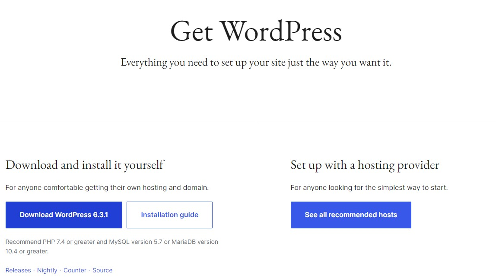

# Installera WordPress på Windows med WAMP

Här är en steg-för-steg-guide om hur du installerar WordPress på Windows med hjälp av WAMP:

## Steg 1: Ladda ner och installera WAMP

1. Gå till WAMPs officiella webbplats (<https://www.wampserver.com/en/>) och ladda ner den senaste versionen av WAMP för Windows.
2. Dubbelklicka på installationsfilen och följ installationsguiden. Välj installationsmapp och de standardinställningar som föreslås.

## Steg 2: Starta WAMP och konfigurera inställningar

1. När WAMP-installationen är klar, hittar du WAMP-ikonen i aktivitetsfältet. Klicka på ikonen och välj "Start All Services" för att starta WAMP-servern.
2. Kontrollera att WAMP-ikonen ändrar färg till grönt, vilket indikerar att servern är igång och fungerar korrekt.
3. Högerklicka på WAMP-ikonen och välj "Apache" -> "httpd.conf" för att öppna konfigurationsfilen.
4. I konfigurationsfilen, sök efter raden som börjar med "DocumentRoot" och ändra sökvägen till din webbplatsens mapp. Till exempel kan du ändra det till "DocumentRoot "C:/wamp/www/"".
5. Spara ändringarna i konfigurationsfilen och starta om WAMP-servern för att säkerställa att ändringarna har tagits i beaktning.

## Steg 3: Skapa en MySQL-databas för WordPress

1. Klicka på WAMP-ikonen, välj "phpMyAdmin" i menyn. Detta öppnar phpMyAdmin i din webbläsare.
2. I phpMyAdmin-kontrollpanelen, klicka på "Databaser" i sidomenyn.
3. Ange ett namn för din WordPress-databas i textrutan "Skapa en databas" och klicka på "Skapa".
4. Databasen kommer nu att visas i vänstermenyn.

## Steg 4: Ladda ner och installera WordPress

1. Gå till WordPress officiella webbplats (<https://wordpress.org>) och ladda ner den senaste versionen av WordPress.
2. Extrahera innehållet i ZIP-filen till din webbplatsens mapp, t.ex., "C:/wamp/www/minwebbplats/".

## Steg 5: Konfigurera WordPress för att ansluta till databasen

1. I webbläsaren, gå till adressen "<http://localhost/minwebbplats>" (ersätt "minwebbplats" med namnet på din webbplatsens mapp).
2. Välj språk och klicka på "Fortsätt".
3. WordPress kommer att visa en sida där du kan ange databasuppgifterna. Ange följande information:
   - Databasens namn: Det namn du gav din WordPress-databas i tidigare steg.
   - Användarnamn: Standardanvändarnamnet för WAMP är "root".
   - Lösenord: Lämna fältet tomt.
   - Databasvärd: Lämna fältet tomt.
   - Tabellprefix: Du kan lämna det som det är eller ändra till något eget.
4. Klicka på "Skicka" och följ instruktionerna för att slutföra installationsprocessen.

## Steg 6: Slutför installationen och logga in på WordPress

1. Ange en webbplatsens titel, användarnamn, lösenord och e-postadress i installationsguiden.
2. Klicka på "Installera WordPress" och vänta tills installationen är klar.
3. När installationen är klar, kommer du att bli ombedd att logga in på din WordPress-webbplats.
4. Ange ditt användarnamn och lösenord som du angav i installationsguiden och klicka på "Logga in".

Grattis! Du har nu installerat och konfigurerat WordPress på Windows med hjälp av WAMP. Du kan nu börja skapa och anpassa din webbplats.
